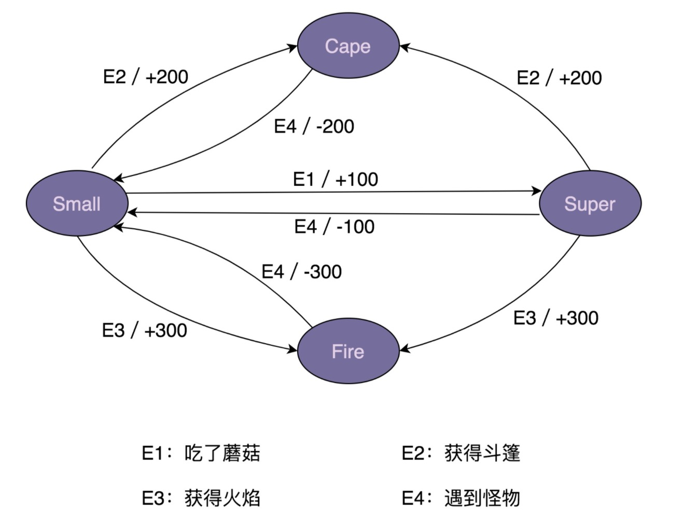

# 状态机模式

* 状态机包含三个部分：状态(state)、事件(event)、动作(action)。其中，事件也被称为转移条件，事件触发状态的转移及动作的执行。不过，动作不是必须的，有可能只是转移状态，不执行任何的操作

## 映射到日常生活的案例

* 以超级马里奥游戏为例。在游戏中，马里奥可以变身为多种心态，分别是：小马里奥(Small Mario)、超级马里奥(Super Mario)、火焰马里奥(Fire Mario)、斗篷马里奥(Cape Mario)等等。在不同的游戏情结下，各个心态会互相转化，并相应的增减积分。比如，初始形态是小马里奥。，吃了蘑菇就会变成超级马里奥，并且增加100积分。

* 实际上，马里奥形态的转变就是一个状态机。其中，马里奥的不同形态就是状态机中的『
  状态』，游戏情节（比如吃了蘑菇）就是状态中的事件，加减积分就是状态机中的动作。比如：吃蘑菇这个事件，会触发状态的转移：从小马里奥编程超级马里奥。以及触发动作的执行(增加100积分)。

* 具体的游戏规则如下所示：

  

* 整个游戏规则用表格统计后，一共有如下事件、状态转移和动作

  |            | 事件     | 状态转移       | 动作      |
  | ---------- | -------- | -------------- | --------- |
  | 小马里奥   | 获取蘑菇 | 变成超级马里奥 | 加100积分 |
  | 小马里奥   | 获得斗篷 | 变成斗篷马里奥 | 加200积分 |
  | 小马里奥   | 获得火焰 | 编程火焰马里奥 | 加300积分 |
  | 超级马里奥 | 获得斗篷 | 变成斗篷马里奥 | 加200积分 |
  | 超级马里奥 | 获得火焰 | 变成火焰马里奥 | 加300积分 |
  | 超级马里奥 | 遇到怪物 | 变成小马里奥   | 减100积分 |
  | 斗篷马里奥 | 遇到怪物 | 变成小马里奥   | 减200积分 |
  | 火焰马里奥 | 遇到怪物 | 变成小马里奥   | 减300积分 |

  

## 映射成代码

### 分支逻辑法

* 参考代码：[简单状态机：分支逻辑法](https://github.com/AvengerEug/design-beautiful/blob/develop/src/main/java/com/eugene/sumarry/designbeautiful/mario/model1/MarioStateMachine.java)
* 对于简单的状态机而言，分支逻辑的实现方式是可以接受的。但是，对于复杂的状态机而言，如果没有分析清楚的话，是很容易的写漏的。并且，每个事件里面充斥着各种if-else，可读性和可维护性都很差，如果哪天修改了状态机的转移逻辑，那就得把所有逻辑都梳理一遍，以防漏改，也很容易写出bug。

